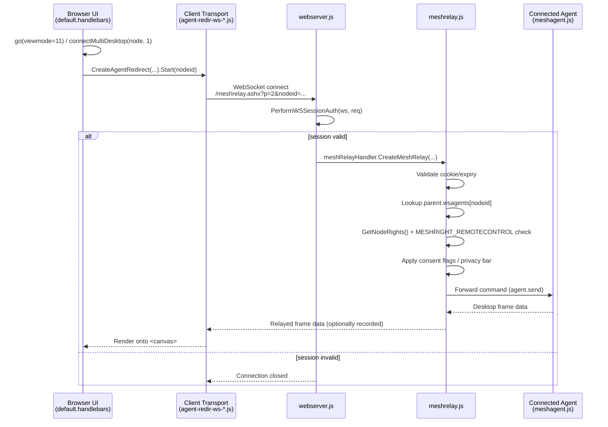

# MeshCentral — Architecture Overview & Feature Trace

**Author:** Rahmeen Khan
**Task:** Task 08 — MeshCentral Codebase Exploration & Contribution
**Repo:** [rahmeenkhan-22/MeshCentral](https://github.com/rahmeenkhan-22/MeshCentral) (fork of [Ylianst/MeshCentral](https://github.com/Ylianst/MeshCentral))

---

## 1. Directory Architecture Overview

| Area | Role |
|---|---|
| `meshcentral.js` | **Composition root.** `CreateMeshCentralServer(config, args)` instantiates every subsystem (webserver, redirserver, mpsserver, swarmserver, smsserver, msgserver, amtManager, letsencrypt, etc.) as properties of one `obj`, wires them together, and hands off control. It also handles CLI-only admin flags (e.g. `--setuptelegram`) by delegating to specialized modules rather than containing that logic itself. It is an orchestrator, not where core logic lives. |
| `webserver.js` | **HTTP/HTTPS + WebSocket layer.** Built on **Express** (`obj.app`) wrapped in `https.createServer(tlsOptions, obj.app)`, with **express-ws** bolted on to add WebSocket support on the same app/server — this is how MeshCentral serves normal page loads and persistent tunnels (agent connections, relay sessions, live desktop/terminal streams) over one port. Can optionally run a second, separate TLS server (`obj.tlsAltServer`) dedicated to agent connections, which is locked to a stricter, modern-only cipher suite (TLS 1.2+, PFS-only ciphers, no SSLv2/v3/TLS1.0/1.1) than the general web server. Also sets up the Handlebars view engine, reverse-proxy trust handling, agent registration rate-limiting (`CreateAgentRegistrationLimiter`), and a serial-tunnel Duplex stream (`SerialTunnel`) used for Intel AMT Serial-over-LAN. |
| `meshagent.js` / `agents/` | **Agent protocol & lifecycle.** Tracks live per-node connection state via bitflag checks (e.g. `state.connectivity & 1`), supports a "recovery agent" fallback mode (`capabilities & 0x40`) that can still report diagnostics if the main agent is broken, validates that an agent's mesh/group still exists before proceeding, and enforces an **IP-based enrollment policy** (`isAgentConnectionAllowedByEnrollmentPolicy`) that only allows new (not-yet-known) agents to register from allowed IPs/domains — known nodes are always allowed. |
| `views/` | **Handlebars templates** for the server-rendered UI. Includes separate **mobile-specific variants** of major pages (`default-mobile.handlebars`, `login-mobile.handlebars`, `error404-mobile.handlebars`, `sharing-mobile.handlebars`) rather than relying purely on responsive CSS. `default.handlebars` is the main device-management application shell (device list, tabs, the `go(viewmode)` page-switch function, etc.). |
| `public/` | **Static client-side assets** — JS, CSS, images, fonts. Notable: pre-built, statically localized `commander-XX.htm` pages (10 language variants of a remote-control commander tool) rather than runtime i18n for that component; bundled third-party libraries including `novnc/` (VNC-in-browser rendering), `xterm.js` (terminal rendering), and the MeshCentral-specific transport scripts (`agent-redir-ws-*.js`, `agent-desktop-*.js`, `agent-rdp-*.js`). |
| `amt/` | **Intel AMT out-of-band management.** `amt-wsman.js`/`amt-wsman-comm.js` implement the WS-Management (SOAP/XML) protocol AMT uses; `amt-xml.js` handles the XML layer; `amt-ider.js`/`amt-ider-module.js` implement IDE-R (remote virtual media mounting); `amt-redir-mesh.js` ties AMT redirection sessions into MeshCentral's mesh/group model; `amt-setupbin.js` handles initial AMT provisioning. |

---

## 2. Feature Trace — Remote Desktop Session Initiation

**Scope:** what happens end-to-end when a user clicks the "Desktop" tab on a connected device (Mesh Agent–based desktop, not Intel AMT KVM).

### Flow summary

1. **UI trigger** — `views/default.handlebars`: the app's `go(viewmode)` function handles tab switching. For the Desktop view it creates a `<canvas>` element to render onto and calls `connectMultiDesktop(node, 1)` (`contype 1` = Mesh Agent desktop, as opposed to `contype 2` = Intel AMT desktop).
2. **Client transport setup** — `connectMultiDesktop` calls `CreateAgentRedirect(meshserver, CreateAgentRemoteDesktop(...), ...)`, defined in `public/scripts/agent-redir-ws-0.1.1.js`. Its `obj.Start(nodeid)` method opens a WebSocket to:
   `wss://<host>/meshrelay.ashx?browser=1&p=2&nodeid=<id>&id=<tunnelid>`
   (`p=2` is the internal protocol number for KVM/Desktop; other values are `1=SOL, 3=IDER, 4=Files, 5=FileTransfer`.)
3. **Server-side routing** — `webserver.js` registers `obj.app.ws(url + 'meshrelay.ashx', ...)` via express-ws. The handler first runs `PerformWSSessionAuth` (validates the browser's session before anything else happens), then dispatches to either a 1-to-n desktop multiplexor or, for a normal single-viewer session, `obj.meshRelayHandler.CreateMeshRelay(...)`.
4. **Relay & agent pairing** — `meshrelay.js`: `CreateMeshRelay` performs cookie/expiry validation (and, for public device-sharing links, a separate identifier check) before calling `CreateMeshRelayEx`. The relay looks up the target agent's live connection via `parent.wsagents[nodeid]` — the server's in-memory registry of currently-connected agents. Before forwarding anything, it checks `parent.GetNodeRights(user, meshKey, nodeKey)` against `MESHRIGHT_REMOTECONTROL` (remote control is its own distinct permission), applies mesh/domain consent flags (drives the on-device "allow remote control?" prompt) and an optional on-screen privacy bar, and — for multi-server deployments — falls back to peer-server routing (`GetRoutingServerIdNotSelf`) if the agent is connected to a different server instance. The command is then sent to the agent (`agent.send(...)`), and the relay can optionally log the session (text or binary format) for recording/audit purposes.
5. **End-to-end tunnel** — once authorized, the browser's WebSocket and the agent's existing WebSocket are paired by the relay, and desktop frame data flows through this tunnel, rendered into the `<canvas>` created in step 1 (via `novnc`-derived rendering logic in the desktop transport script).

### Sequence diagram

---

## 3. Observations worth noting

- **Layered authorization**: session auth (webserver.js) → cookie/expiry validation (meshrelay.js) → per-node rights + explicit `MESHRIGHT_REMOTECONTROL` check → consent flags/privacy bar. Remote control is never a single yes/no gate — it's several independent checks stacked in sequence.
- **Security-hardened agent channel**: the dedicated agent TLS port (when enabled) is locked to PFS-only, TLS 1.2+ ciphers — stricter than the general-purpose web server's TLS config.
- **Clustering support**: `GetRoutingServerIdNotSelf` in `meshrelay.js` indicates MeshCentral is designed to run as multiple server instances sharing agent routing, not just a single-node deployment.
- **Session recording/audit**: relay sessions can be logged in text or binary format with timestamps — directly relevant to SOC/monitoring use cases.
- **A noted TODO in `meshagent.js`**: orphaned agents (whose mesh no longer exists) are currently just held/ignored rather than actively cleaned up or reassigned — a legitimate candidate area for a future contribution.
